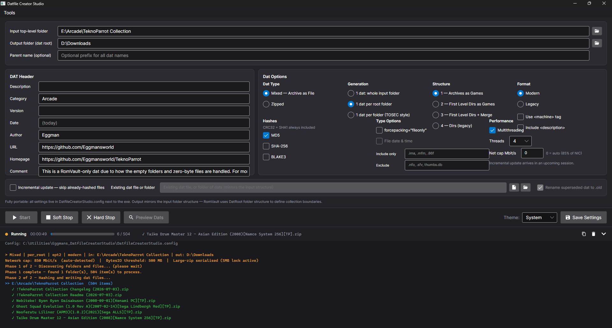
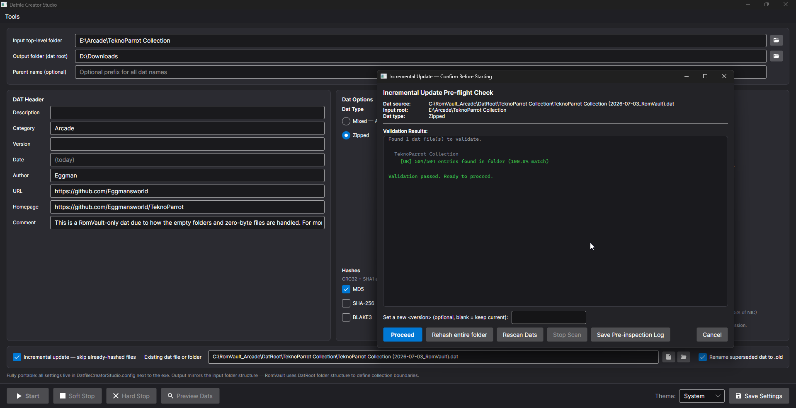

# Eggman's Datfile Creator Studio


Whether you're a casual collector who just wants RomVault to recognise your files, or a preservation veteran managing hundreds of thousands of ROMs across structured archives, this tool was built for you. Point it at a folder, hit **Start**, and get clean, consistent **Logiqx XML** datfiles — no scripting, no manual XML editing, no guesswork.

Bulk-generates datfiles compatible with **RomVault, ClrMamePro, and RomCenter**. Supports both **Mixed (Archive as File)** and **Zipped** collection types across two structure options, both verified against RomVault's own dat parser. An incremental update engine lets you rehash only what has changed, so revisiting a large collection doesn't mean starting from scratch. CRC32 and SHA1 are always included; MD5, SHA-256, and BLAKE3 are optional. ZStandard-compressed ZIPs are fully supported.


Datfile Creator Studio is a native **C# / [Avalonia](https://avaloniaui.net/)** desktop application — a ground-up rewrite of the original Python/Tkinter *Datfile Creator Suite*, with a modern Fluent interface, an auto-sliding activity-log drawer, true multithreaded hashing, and a single self-contained executable that needs no runtime installed. Its output is **byte-for-byte identical** to the original suite (see [Parity](#parity)).

### 🛠 Additional Included Tools

| Tool | What it does |
|---|---|
| **Folder Structure Analyzer** | Inspects your collection folders and recommends the right structure option before you run |
| **Long Path Length Repair** | Identifies and allows you to interactively repair files and folders whose full path length approaches or exceeds the Windows 260-character `MAX_PATH` limit; can be launched standalone or directly from the Folder Structure Analyzer with scan results pre-loaded |
| **Bulk Datfile Header Updater** | Find and replace header fields (author, version, URL, etc.) across an entire folder of datfiles at once |
| **Game and ROM Counter** | Tallies total games, ROMs, and collection size across any set of datfiles |
| **Validate Datfiles** | Validates every `<rom>` entry and checks required attributes are present and correctly formatted |
| **Merge Datfiles** | Merges per-subfolder datfiles upward into a single dat at the first-level subfolder of a category root |
| **Recursive Archive Extractor** | Extracts ZIP, 7Z, and RAR archives recursively through nested folder trees |
| **ZIP Store Packer** | Repacks files into uncompressed ZIP_STORED archives — fast and RomVault-friendly |
| **Remove ReadOnly Attribute** | Strips read-only flags and NTFS alternate data streams from files and folders in bulk |

---

If this tool saves you time, consider supporting the work:

<a href="https://buymeacoffee.com/eggmansworld">
  
</a>

---

## Table of Contents

- [Requirements](#requirements)
- [Install](#install)
- [Build from Source](#build-from-source)
- [Quick Start](#quick-start)
- [Interface Overview](#interface-overview)
  - [Paths](#paths)
  - [DAT Header Fields](#dat-header-fields)
  - [Options](#options)
- [Dat Types](#dat-types)
  - [Mixed — Archive as File](#mixed--archive-as-file)
  - [Zipped](#zipped)
- [Generation Modes](#generation-modes)
- [Structure Options](#structure-options)
- [Options that were removed](#options-that-were-removed)
- [Hash Options](#hash-options)
- [Multithreading](#multithreading)
- [Network Cap](#network-cap)
- [Extension Filters](#extension-filters)
- [ZStandard Support](#zstandard-support)
- [Parent Name and Output Folder Structure](#parent-name-and-output-folder-structure)
- [Dat Preview Window](#dat-preview-window)
- [Activity Log Drawer](#activity-log-drawer)
- [Incremental Update — Skip Already-Hashed Files](#incremental-update--skip-already-hashed-files)
- [Folder Structure Analyzer](#folder-structure-analyzer)
- [Tools Menu](#tools-menu)
- [Settings and Config File](#settings-and-config-file)
- [Advanced: Datfile Landscape Analysis](#advanced-datfile-landscape-analysis)
- [Advanced: DAT Format Reference](#advanced-dat-format-reference)
- [Known Limitations](#known-limitations)
- [Parity](#parity)
- [License](#license)

---

## Requirements

**To run:** nothing. The release builds are fully self-contained — no .NET runtime, no Python, no pip packages. Everything the app needs (ZStandard decompression, BLAKE3, NIC-speed detection) is built in.

The only external dependency is optional and used by a single tool: the **Recursive Archive Extractor** shells out to [**7-Zip-ZStandard**](https://github.com/mcmilk/7-Zip-zstd/releases) (`7z.exe`) for ZIP/7Z/RAR extraction. You only need it if you use that tool.

**To build from source:** the [**.NET 10 SDK**](https://dotnet.microsoft.com/download).

---

## Install

1. Download the latest `DatfileCreatorStudio-win-x64.zip` from the [Releases](../../releases) page.
2. Extract it anywhere.
3. Run `DatfileCreatorStudio.exe`.

The app is fully portable — every setting lives in a single `DatfileCreatorStudio.config` file written next to the executable. No registry keys, no `%APPDATA%`, no temp files.

---

## Build from Source

```
git clone https://github.com/Eggmansworld/DatfileCreatorStudio.git
cd DatfileCreatorStudio
dotnet run --project src/DatfileCreatorStudio
```

To produce a self-contained single-file build:

```
pwsh ./publish-win.ps1      # -> dist/win-x64/DatfileCreatorStudio.exe
```

The solution is split into `DatfileCreator.Core` (the engine and all tool logic, no UI dependencies) and `DatfileCreatorStudio` (the Avalonia app).

---

## Quick Start



1. Set your **Input top-level folder** — the folder that contains the game folders you want to dat.
2. Set your **Output folder** — where the datfiles will be written (mirrors input folder structure).
3. Fill in the fields in the header section to suit your dat(s).
4. Choose **Dat Type**: Mixed or Zipped.
5. Choose **Generation**: *1 dat per root folder* (most common).
6. Choose **Structure**: *Standard* is the right choice for the majority of collections.
7. Click **Start**.

The **activity log drawer** slides up automatically when the run begins, showing live status, a progress bar, elapsed time, and colour-coded activity. **Preview Dats** lights up when the run completes.

Not sure which structure to use? Use **Tools → Analyze Folder Structure** before your first run.

---

## Interface Overview

### Paths

| Field | Purpose |
|---|---|
| **Input top-level folder** | The folder whose immediate subfolders become individual dat jobs |
| **Output folder (dat root)** | Root of the output structure. Datfiles are written into subfolders that mirror the input |
| **Parent name (optional prefix)** | Prepended to every dat name: `Parent - TopLevel - Subfolder` |

All path fields support drag-and-drop. The path to `7z.exe` (used only by the Recursive Archive Extractor) is set inside that tool's own window.

### DAT Header Fields

These map directly to the `<header>` block in the output datfile. All fields are optional. Blank fields write empty tags, which is valid and expected in Logiqx XML.

| Field | Header tag | Notes |
|---|---|---|
| Description | `<description>` | Free text. Typically matches the collection name |
| Category | `<category>` | e.g. `PC`, `Arcade`, `Commodore` |
| Version | `<version>` | Release version or date stamp |
| Date | `<date>` | Defaults to today's date at runtime |
| Author | `<author>` | Your name or handle |
| URL | `<url>` | Project or source URL |
| Homepage | `<homepage>` | Homepage URL |
| Comment | `<comment>` | Free text notes |

The `<name>` tag is populated automatically from the dat filename stem. Every dat also receives `<romvault/>` as the last header tag — this is the base RomVault recognition token, and expands to `<romvault forcepacking="fileonly"/>` when Mixed mode is active.

### Options

The UI greys out options that do not apply to the current combination of Dat Type and Generation mode — this prevents invalid combinations without hiding the controls. Every option has a short tooltip describing what it does.

---

## Dat Types

### Mixed — Archive as File

The file **itself** is the ROM entry. The zip, 7z, or any other archive file is hashed as a single opaque file — its contents are not inspected.

Use this when RomVault is managing archives as **atomic units** — each archive is one logical game entry in your collection, and RomVault will not look inside it.

```xml
<game name="Lemmings (1991) (Psygnosis) [360K]">
    <description>Lemmings (1991) (Psygnosis) [360K]</description>
    <rom name="Lemmings (1991) (Psygnosis) [360K].zip"
         size="1423168" crc="a3f82b1c" sha1="d4e9c02a7f1b3e5d8c6a0f4b2e7d1a9c3f5b8e2d"/>
</game>
```

The header always contains `<romvault forcepacking="fileonly"/>`, which instructs RomVault to treat every matched file as a file-only entry regardless of extension.

**When to use Mixed:**
- PC floppy/CD image collections where each game is a discrete archive
- Any collection where the archive boundary is the logical game boundary
- Collections managed as scene-style releases where the zip is the delivery unit

#### ⚠️ RomVault Mixed/fileonly Caveat

- Dats created in **Mixed (Archive as File)** mode (aka "fileonly") have a fileonly header tag added to indicate to RomVault that it is dealing with a fileonly dat and to display it as such.
- The dat's `<rom>` entries need to be wrapped in a `<game>` block, which is named after its parent folder name. This `<game>` block must exist to support the ability for a user to switch the Dat Rule on the folder from fileonly to a compression format if they decide they want to compress the folder. Without the `<game>` block, RomVault will throw errors forever and require the user to kill the process.
- Adding the `<game>` block creates a new internal "set" folder for the fileonly roms to reside in, but this throws out the alignment of the dat folder vs. the file folder. Pre-existing roms will end up with a Cyan status because of the insertion of this folder. If you try to scan and rebuild, you'll end up with an extra root folder in your folder path, which is very likely undesirable.
- **To fix this, set a DAT Rule on the parent folder of "Single Archive", and "Do not use subdirs for sets" to remove the internal `<game>` block and have the folder behave like a fileonly dat again.**

➡️ **This anomaly occurs because of how RomVault is coded, not how the datfile is designed. Until RomVault can learn how to handle its users changing the Dat Rule settings on fileonly folders, this workaround must exist.**

Additional factoid: if you load a datfile and get an **"Incompatible Compare Type"** error when trying to apply the compression setting to a folder, load the datfile into a text editor and check if the `<rom>` contents have a `<game>` block wrapped around the files. If not, one must be added.

### Zipped

The **contents** of each zip archive are hashed. Each zip becomes a game entry, and each file inside the zip becomes a `<rom>` entry within that game.

Use this when RomVault is expected to open, verify, and manage individual files within archives — the standard mode for ROM sets from No-Intro, Redump, TOSEC, and similar databases.

```xml
<game name="Lemmings (1991) (Psygnosis) [360K]">
    <description>Lemmings (1991) (Psygnosis) [360K]</description>
    <rom name="Disk 1.ima" size="368640" crc="3a9f12b4" sha1="e2c8a4f1b9d3e7c5a2f8b4d0e6c2a8f4b6d2e8c4"/>
    <rom name="Disk 2.ima" size="368640" crc="7b2e45c1" sha1="f3d9b5e2c1a4f8b6d2e0c6a3f9b5e1c7a3f9b5e1"/>
</game>
```

Internally zipped subfolders are always preserved in the rom name:

```xml
<rom name="original/Lemmings (1991) (Psygnosis) [360K] (Disk B).ima" size="368640" crc="9c4a21d7" sha1="..."/>
```

Empty folders inside a zip produce a zero-byte rom entry with canonical empty hashes, matching RomVault's behaviour:

```xml
<rom name="path/to/emptydir/" size="0" crc="00000000"
     sha1="da39a3ee5e6b4b0d3255bfef95601890afd80709"
     sha256="e3b0c44298fc1c149afbf4c8996fb92427ae41e4649b934ca495991b7852b855"
     md5="d41d8cd98f00b204e9800998ecf8427e"/>
```

---

## Generation Modes

### 1 Dat per Top-Level Folder (Single Dat)

The **entire input folder** is captured in **one datfile**, including every subfolder at every depth. The dat is named after the input folder alone (the optional Parent Name field is ignored in this mode) and is written directly into the output folder with no mirrored subfolder.

Use this mode for a one-off scan of a single directory — for example, to generate one datfile to add to an existing collection, or to manually replace a single dat.

### 1 Dat per Root Folder (Simple Collection)

Each immediate subfolder of the input root becomes **one datfile**. All content within that subfolder — regardless of depth — is rolled into the single dat.

Given this input:
```
E:\Floppy\Access Software\
    Amazon (1992)\
        amazon.zip
        Docs\
            amazon_manual.zip
    Crime Wave (1990)\
        crime_wave.zip
```

The tool produces:
```
Output\Access Software\
    Parent - Floppy - Amazon (1992) (2026-04-24_RomVault).xml
    Parent - Floppy - Crime Wave (1990) (2026-04-24_RomVault).xml
```

The content of `Docs\` within `Amazon (1992)\` is captured inside the Amazon dat — how it appears depends on the chosen **Structure** option. Use this mode when each top-level subfolder represents a single logical unit (one game title, one publisher, one platform).

### 1 Dat per Root Folder and All Subfolders (TOSEC Style)

Every folder at every depth that contains relevant content gets its own datfile. The output folder structure mirrors the input exactly. This is the style of granularity used by the TOSEC collection. Each dat contains only the content sitting directly in that specific folder — no recursive capture.

Use this mode for large heterogeneous collections where subfolders are logically independent (different platforms, publishers, or release types sharing a common input root).

---

## Structure Options

Structure answers one question: **where does a single dat entry begin?**

Every dat is a list of *sets* (`<game>` entries). A set is the unit RomVault matches, fixes and reports on. The two structures differ only in where they draw the boundary of a set — at each archive, or at each top-level folder.

Structure applies to the two recursive (tree) modes — **1 Dat per Top-Level Folder** and **1 Dat per Root Folder** — where one dat captures nested content. In **1 dat per root folder & all subfolders**, every dat is flat by definition, so the Structure options are disabled.

Use the **Preview window** to compare both against your own data before committing — it re-renders instantly from the completed run, with no re-hashing. Not sure where to start? Run **Tools → Analyze Folder Structure** first.

> **Zipped dats always use Standard.** *Grouped* is Mixed-only, and the app disables it when you select Zipped. In a dat, a `<game>` resolves to a physical *archive* — RomVault decides that once for the whole dat from the `forcepacking` header, never per entry. So naming a folder that holds several separate zips as one set would claim an archive exists that does not, and RomVault would offer to repack your collection into it. There is no way to express "this folder is the set" in a Zipped dat, so the option is not offered.

### The example collection

Both examples below describe this same input folder, scanned as **Mixed**:

```
Crime Wave Collection\
    readme.txt                            ← loose file at the top level
    Crime Wave (1990)\                    ← holds files AND a subfolder
        Crime Wave (Disk A).ima
        Crime Wave (Disk B).ima
        original\
            Crime Wave (v1.0).ima
        saves\                            ← EMPTY folder
    Deluxe Paint IV\                      ← holds files only
        DPaint4.adf
    Documentation\                        ← container: no files of its own
        Box Scans\
            Crime Wave Box.png
        Manuals\
            Crime Wave Manual.pdf
```

Two features of this layout do the work of telling the structures apart:

- **`Documentation\`** holds no files itself, only subfolders. *Standard* keeps it as a browsable directory; *Grouped* turns it into a single set.
- **`saves\`** is empty. All three record it with an explicit folder entry — a dat has no other way to state that a folder exists, and without one RomVault would never recreate it. Zero-byte files are captured the same way, with the canonical empty-content hashes.

Both examples are real output from the tool, trimmed of the header.

---

### Standard

> **One set per archive — or per folder that directly holds files.** The folders above stay as directories.

This is the default, and it is what No-Intro, Redump, TOSEC and the overwhelming majority of community dats use. It mirrors your collection: the dat's shape follows your folder tree, and a set appears wherever the content actually lives, however deep that happens to be.

A folder that contains files becomes a set. A folder that contains only other folders stays a `<dir>` — a container you can expand in RomVault — and the search continues inside it.

```xml
<rom name="readme.txt" size="6" crc="873586f3" sha1="f78a71af8..."/>
<game name="Crime Wave (1990)">
    <description>Crime Wave (1990)</description>
    <rom name="Crime Wave (Disk A).ima" size="5" crc="3ddb8b7a" sha1="15f33e58..."/>
    <rom name="Crime Wave (Disk B).ima" size="5" crc="a4d2dac0" sha1="554ad0c1..."/>
    <rom name="original/Crime Wave (v1.0).ima" size="3" crc="4fb9faee" sha1="85a03bae..."/>
    <rom name="saves/" size="0" crc="00000000" sha1="da39a3ee5e6b4b0d3255bfef95601890afd80709"/>
</game>
<game name="Deluxe Paint IV">
    <description>Deluxe Paint IV</description>
    <rom name="DPaint4.adf" size="3" crc="be1437ad" sha1="2a93c572..."/>
</game>
<dir name="Documentation">
    <game name="Box Scans">
        <description>Box Scans</description>
        <rom name="Crime Wave Box.png" size="4" crc="c4b3b3ae" sha1="ffa9c24c..."/>
    </game>
    <game name="Manuals">
        <description>Manuals</description>
        <rom name="Crime Wave Manual.pdf" size="3" crc="69a297d8" sha1="8175e3c8..."/>
    </game>
</dir>
```

**RomVault shows 4 sets**, with `Documentation` as a folder you can open to find `Box Scans` and `Manuals` inside it as separate sets. `readme.txt` sits at the top as a loose file, exactly where it is on disk.

Note `original/Crime Wave (v1.0).ima` — the subfolder is kept as a path inside the rom name. That is the only way a dat can express a folder inside a set, and RomVault rebuilds it into a real subfolder when it loads.

**Use it when:** almost always. Choose it unless you have a specific reason not to — and you must choose it for Zipped dats.

**Trade-off:** a title split across subfolders becomes several separate sets rather than one. If `Documentation` is conceptually one thing, Standard still reports it as two.

---

### Grouped

> **One set per top-level folder.** Everything inside is gathered into that single set, with folder paths kept in the rom names.

*Mixed dats only.*

Grouped draws the set boundary at a fixed depth: every first-level folder becomes exactly one set, whether or not it holds files directly. Nothing below that level appears as a separate entry — it is folded into the parent, with its path preserved in the rom name.

Compare against Standard: `Documentation` is no longer a directory containing two sets. It is now **one set** whose contents happen to live in subfolders.

```xml
<rom name="readme.txt" size="6" crc="873586f3" sha1="f78a71af8..."/>
<game name="Crime Wave (1990)">
    <description>Crime Wave (1990)</description>
    <rom name="Crime Wave (Disk A).ima" size="5" crc="3ddb8b7a" sha1="15f33e58..."/>
    <rom name="Crime Wave (Disk B).ima" size="5" crc="a4d2dac0" sha1="554ad0c1..."/>
    <rom name="original/Crime Wave (v1.0).ima" size="3" crc="4fb9faee" sha1="85a03bae..."/>
    <rom name="saves/" size="0" crc="00000000" sha1="da39a3ee5e6b4b0d3255bfef95601890afd80709"/>
</game>
<game name="Deluxe Paint IV">
    <description>Deluxe Paint IV</description>
    <rom name="DPaint4.adf" size="3" crc="be1437ad" sha1="2a93c572..."/>
</game>
<game name="Documentation">
    <description>Documentation</description>
    <rom name="Box Scans/Crime Wave Box.png" size="4" crc="c4b3b3ae" sha1="ffa9c24c..."/>
    <rom name="Manuals/Crime Wave Manual.pdf" size="3" crc="69a297d8" sha1="8175e3c8..."/>
</game>
```

**RomVault shows 3 sets** — one per top-level folder — with no intermediate directories to expand. Every file is still tracked at its exact path; only the *grouping* changed.

**Use it when:** each top-level folder is one release and you want it reported as one thing. Multi-disc games, releases bundled with extras or goodies packs, and anything where "is this title complete?" is the question you actually want RomVault to answer.

**Trade-off:** the folders that hold your files stop being visible as structure in RomVault's tree until it expands the rom paths — the information is all there, but a set with hundreds of merged files reads as one long list.

---

### Choosing quickly

| Your situation | Structure |
|---|---|
| Anything Zipped | **Standard** (the only option) |
| Standard ROM sets — No-Intro, Redump, TOSEC | **Standard** |
| You want the dat to mirror your folder tree | **Standard** |
| Each top-level folder is one title you want reported as one set | **Grouped** |
| Multi-disc / bundled-extras releases | **Grouped** |

Both describe the same files with the same hashes, and both capture empty folders and zero-byte files. Switching structure changes how RomVault *groups and reports* them — never which files are tracked.

---

## Options that were removed

Earlier versions offered a "Dirs" structure and a Modern/Legacy format switch. Both wrote `<rom>` entries inside `<dir>` tags, and **RomVault cannot read those at all.**

RomVault's parser only ever looks for a fixed set of child elements:

| Element | Children RomVault reads |
|---|---|
| `<datafile>` | `dir`, `game`, `machine`, `rom`, `disk` |
| `<dir>` | `dir`, `game`, `machine` — **never `rom`** |
| `<game>` / `<machine>` | `rom`, `disk` + metadata — **never `dir` or `game`** |

So a `<dir>` is a container of *sets*, and a `<game>` is a container of *files*. A subfolder inside a set has exactly one valid encoding — a `/` inside the rom's name — which RomVault expands back into a folder tree when it loads the dat. Anything outside that grammar is **silently discarded**: RomVault does not warn, it simply loads nothing, and then offers to relocate the files it cannot account for.

Dats written with the old "Dirs" structure or the "Legacy" format therefore loaded into RomVault as completely empty. Both were removed rather than left as traps; if your saved settings used either, the app moves you to the nearest valid choice and says so in the activity log.

A third structure, **Grouped + Folders**, was also removed. It behaved exactly like *Grouped* but additionally wrote an entry for folders that already contained files. RomVault discards those as it loads, because a folder holding files is already implied by the paths of the files inside it — so the two produced identical results. Empty folders, the thing it actually existed to preserve, are now recorded by both remaining structures.

If you need a dat for ClrMamePro or another toolchain that wants that older shape, use a purpose-built converter — this tool targets RomVault.

The **Use `<machine>` instead of `<game>`** option remains available. It is the element name used by EmuMovies and some MAME-derived dats; RomVault reads `<machine>` and `<game>` identically. Unless you specifically need it, leave it set to `<game>`.

---

## Hash Options

CRC32 and SHA1 are always computed. Both are mandatory in Logiqx XML and are the primary integrity verification hashes used by RomVault.

| Option | Attribute | Notes |
|---|---|---|
| **MD5** | `md5=` | Optional. Adds meaningful overhead per file. Written after `sha1=` in the rom tag |
| **SHA-256** | `sha256=` | Optional. Written after `sha1=` and before `md5=`. Informational — RomVault displays it but does not use it for matching |
| **BLAKE3** | `blake3=` | Optional. Forward-looking hash. Written after `md5=` and before `date=`. No current tool consumes it; unknown attributes are ignored by RomVault, so dats with BLAKE3 stay fully valid |

Attribute order in the output rom tag follows the RomVault DATReader source, with BLAKE3 (non-native to RomVault) appended at the tail before `date`:
`name` → `size` → `crc` → `sha1` → `sha256` → `md5` → `blake3` → `date`

### Why include BLAKE3 now?

BLAKE3 is faster than CRC32, MD5, SHA-1, and SHA-256, and is the preservation community's likely successor to the older hashes. No tool reads the `blake3=` attribute yet, but because Logiqx-consuming tools ignore attributes they do not recognise, a dat carrying BLAKE3 values loads and verifies exactly as it would without them. Including BLAKE3 now seeds real-world example dats that tool authors (RomVault included) can point at and build support against.

When **incremental update** runs with BLAKE3 enabled against a dat that predates BLAKE3, any unchanged entry that lacks a valid `blake3=` value is rehashed so the value gets populated — you never end up with a half-populated dat.

---

## Multithreading

The hashing engine processes multiple archives in parallel. Thread count is set via the **Threads** control (1–8, default 4). Unlike the Python original, hashing here runs on true native threads with no interpreter lock, so parallelism scales cleanly with CPU cores and I/O.

For network-backed collections, the optimal thread count depends on your NIC speed and the latency of your storage server. On a 1 Gbps link, 4–8 threads typically saturates the connection. On a 10 Gbps link or fast local NAS, higher values may help.

> The Network Cap applies across all threads combined — increasing the thread count does not bypass the cap.

---

## Network Cap

The hashing engine reads files from a network share at full available speed, which can saturate a 1 Gbps connection and impact other network users. A token-bucket rate limiter keeps throughput below a configurable ceiling.

**Auto mode (default, `Net cap = 0`):** the app detects your fastest active network adapter and caps reads at 85% of its link speed, leaving 15% free for other traffic. NIC detection is built in — no external dependency.

**Manual mode:** enter a value in Mbit/s in the **Net cap Mbit/s** field. Setting `0` returns to auto mode.

> The cap only applies when the input path is a **network share** (UNC or mapped network drive). Local NVMe/SATA/USB drives are never throttled.

---

## Extension Filters

Available in **Mixed mode only** — in Zipped mode the unit is always the complete `.zip` file.

| Field | Behaviour |
|---|---|
| **Include only extensions** | If set, only files matching these extensions are hashed and included. Blank = include everything |
| **Exclude extensions / files** | Files matching these extensions or exact filenames are always skipped |

**Format:** Comma-separated. Leading dots are optional. Full filenames are supported.

```
.ima, .mfm, .86f, .td0        ← include only floppy image formats
.nfo, .sfv, .md5, thumbs.db   ← typical exclusion list
```

Filtering is applied during the folder scan phase, before any hashing begins. Excluded files never enter the work queue.

---

## ZStandard Support

Zip archives compressed with **RV-ZStandard** (method 93) are handled natively — no external tools are required for reading zip contents.

**Detection:** An RV-ZStandard archive can be identified by its zip comment, which begins with `RVZSTD-` followed by a CRC32 checksum (e.g. `RVZSTD-22DA5DD0`). TorrentZip archives use a similar deterministic recompression approach that also sets standardised internal timestamps (`1980/00/00 00-00-00`).

> ⚠️ The `RVZSTD-` comment is written exclusively by RomVault as a marker for its own internal handling. This tool **reads and detects** it but never writes it into archives it creates.

**Supported compression methods:**

| Method | Description |
|---|---|
| 0 | Stored (no compression) |
| 8 | Deflate (standard zip) |
| 93 | ZStandard / RVZSTD |

**File date and timestamps (Zipped mode):** When **File date & time** is enabled, the timestamp for each rom entry is read from the zip's internal metadata and written as `date="yyyy/mm/dd hh-mm-ss"`. For TorrentZip and RV-ZStandard archives this will always be `1980/00/00 00-00-00` — the standardised DOS epoch timestamp these tools write. This is intentional — it documents that the archive has been deterministically recompressed.

**7-Zip-ZStandard** (`7z.exe`) is still required if you use the **Recursive Archive Extractor** tool for ZIP/7Z/RAR extraction. It is not used for dat hashing.

---

## Parent Name and Output Folder Structure

### Dat Naming

Every datfile is named using the following pattern:

```
[ParentName - ] TopLevelFolderName - SubFolderName (YYYY-MM-DD_RomVault).xml
```

The `_RomVault` suffix is deliberate — it flags dats produced by this tool to downstream tools and distribution platforms, and prevents name collisions with dats from other sources covering the same content. The **Parent name** field was added to support external dat distribution platforms where generic or duplicated dat names cause indexing conflicts.

### Output Folder Structure

Output always mirrors the input folder structure, rooted at a folder named after the input top-level folder. This matches RomVault's expected DatRoot layout, where datfiles and their parent folders establish the scanning hierarchy. **Do not output flat** — RomVault uses the folder structure of DatRoot to define collection boundaries.

---

## Dat Preview Window

After a run completes, the **🔍 Preview Dats** button becomes active. It opens a preview window showing the XML of every dat produced during that run.

- List of all completed dats — click any entry to switch
- Four **Structure** radio buttons, independent from the main window — switching any option instantly re-renders the selected dat from in-memory data, with no re-hashing
- Full XML syntax highlighting (tag names, attribute names, attribute values)
- Selectable and copyable text
- **Save Chosen Dat Structure As...** — writes the currently displayed XML to a file of your choosing, named with the structure label appended

The preview re-renders entirely from the hash data held in memory — switching structures is instantaneous even for large dats. This is the equivalent of dir2datUI's live preview mode, and is the recommended way to evaluate structure options against your real data before deciding which to use for a project.

---

## Activity Log Drawer

Instead of a separate progress window, live activity appears in an **auto-sliding drawer** docked at the bottom of the main window. It slides up automatically when a run begins and can be collapsed to a slim status strip at any time.

- Live status line, item counts, progress bar, and elapsed clock
- Colour-coded entries: amber for phase/scan events, blue for folder boundaries, tan for subfolder markers, green for successfully hashed items, grey for carried items (incremental mode), red for errors, bright green for completed dat files
- Per-zip diagnostics, e.g. `✓ GameName.zip (648.4 MB in 6.2s = 104.6 MB/s (1333 entries, stream))`
- Right-click a highlighted path → **Open in File Explorer**
- **Copy** the full log or **Clear** it from the strip
- **Start / Soft Stop / Hard Stop** controls in the action bar

If anything ever goes wrong, an unhandled error is written to `DatfileCreatorStudio.crash.log` next to the executable.

---

## Incremental Update — Skip Already-Hashed Files

For large collections — particularly those in the hundreds of GB or multi-TB range — rehashing every file on every run is impractical. Incremental update mode updates an existing datfile by hashing only new or changed content, carrying forward hash data for everything that hasn't changed.



**Enable it:** tick **Incremental update — skip already-hashed files** and point the **Existing dat file or folder** field to the dat you want to update (or the folder containing your dats for bulk updates). Optionally tick **Rename superseded dat to .old** to invalidate the previous datfile in RomVault once the update is complete.

### How it works

When Start is pressed with incremental mode active, a **Pre-flight Check** dialog opens before any processing begins:

1. **Validation** — the tool scans the dat source recursively and cross-checks each dat's entries against the source file/zip folder. It reports a match percentage per dat, flags missing entries, and identifies new items to be added.
2. **New version** — optionally set a new `<version>` string for the updated dat header.
3. **Proceed / Rehash entire folder / Rescan Dats / Save Pre-inspection Log / Cancel** — choose how to continue.

### Matching strategy

**Zipped mode:** Each zip is checked against the dat using filename + uncompressed size + CRC32 (read from the zip central directory — no decompression needed, takes milliseconds). If all three match, the existing SHA1, MD5, SHA-256, and BLAKE3 values are carried forward directly from the dat. Only new or changed zips are fully analyzed. (Exception: if BLAKE3 is enabled and a matched entry has no stored BLAKE3, it is rehashed so the value gets added.)

**Mixed mode:** Files are matched by filename + size only. If both match, existing hash data is carried forward across every file in every game subfolder. If a file was replaced with content of the same name and size, the change cannot be detected without a full rehash — the Pre-flight Check dialog warns of this, and offers a full-rehash option.

### After a successful update

- The new datfile is written with today's date in both the filename and the `<date>` header field.
- If **Rename superseded dat to .old** is ticked, the original datfile is renamed to `filename.xml.old` — this invalidates it from RomVault's perspective while preserving it for reference. If an `.old` file already exists, a numeric suffix is appended.
- There is never more than one active `.xml` datfile in a folder at a time.

If the match percentage drops below 80%, the Pre-flight Check displays a warning. You can still proceed — entries not found in the source folder will be removed from the updated dat — but the warning gives you the chance to verify path alignment first.

---

## Folder Structure Analyzer

Available via **Tools → Analyze Folder Structure...**.

If you are unsure which Generation mode or Structure option is appropriate for a collection, the Analyzer examines the folder layout and makes a recommendation before any hashing takes place. It walks the folder structure in a background thread (no hashing, completes in seconds even for very large collections) and reports:

- Total folders and items found, and depth distribution
- Pattern breakdown — flat game folders, container folders, folders with nested subdirs
- Sample folder names for spot-checking
- **Recommendation** — a suggested Generation mode and Structure option, colour-coded by confidence
- **Path length statistics** — count of files approaching or exceeding the Windows 260-character `MAX_PATH` limit, with a direct **Open Path Repair Tool** button

Clicking **Apply Recommended Settings** fills the main window's Dat Type, Generation, Structure, Format, and Input folder fields automatically and closes the Analyzer.

---

## Tools Menu

### Long Path Length Repair

Identifies files and folders whose full path length approaches or exceeds the Windows 260-character `MAX_PATH` limit, and lets you rename them interactively to bring them under threshold. Filter between All / Warning (≥200 chars) / Critical (≥260 chars) / Pending; edit the stem with a live character counter; preview, then Apply Selected or Apply All; Undo Last; rename a parent folder and cascade the change; Save/Import a rename log. Can be launched standalone or pre-loaded from the Analyzer.

### Bulk Datfile Header Updater

Updates header fields of all datfiles in a folder (or a single file) in bulk. Leave a field blank to leave it untouched, enter a value to overwrite it in every dat, or tick **Clear** to erase it. **Date** is always required and updates both the `<date>` tag and the `(YYYY-MM-DD_RomVault)` filename token. Both `.xml` and `.dat` files are processed recursively; each file's existing formatting and encoding are preserved.

### Game and ROM Counter

Scans a folder of datfiles and reports the game count, ROM count, and total uncompressed size for each dat — answering the question no ROM manager readily does: **how many games (not just ROMs) are in each folder?** Tree/flat views, clickable column sort, multi-selection with a live subtotal, a full Collection Summary panel, and CSV export. Sizes reported in decimal MB/GB/TB.

### Validate Datfiles

Scans every `<rom>` entry in a dat (or a folder of dats) and checks that required attributes are present and correctly formatted: `size` (decimal), `crc` (8 hex chars), `sha1` (40 hex chars); optional `md5`/`sha256`/`blake3` are validated when present. Every anomaly is reported with its line number.

### Merge Datfiles

Merges per-subfolder datfiles upward into a single dat placed at the first-level subfolder of a category root. Select the **category root** (e.g. `Amiga`); each first-level subfolder whose dats live in deeper subfolders is merged into one dat written into that subfolder.

```
Amiga\                          ← select this as the root
    [ADF]\                      ← first-level subfolder
        [#-B]\                  ← has a dat  ┐
        [C-D]\                  ← has a dat  ┘ merged together
         → writes: Amiga - [ADF] (date_RomVault).xml  into [ADF]\
    [BIN]\                      ← already has a dat directly → skipped
```

For dats nested three or more levels deep, rom names are prefixed with the intermediate folder path (e.g. `[A-F]/foo.adf`) so RomVault can still locate the files.

### Recursive Archive Extractor

Recursively extracts ZIP, 7Z, and RAR archives into their own named subfolders, with optional auto-extraction of archives found nested inside extracted content. Same-as-source or mirror-to-custom-destination output; after-extraction options of Keep / Recycle Bin / Permanent delete / Move (mirror) / Move (flat dump). Uses the 7-Zip-ZStandard path set in the tool window. *Windows only* (relies on the Windows shell for the Recycle Bin option).

### ZIP Store Packer

Wraps files in uncompressed `ZIP_STORED` containers — a neutral byte-preserving wrapper before downstream recompression by RomVault or other tools. Configurable target extensions (removable pill tags), verify-before-delete, skip-if-`.zip`-exists, and recursive or non-recursive scan.

### Remove ReadOnly Attribute

Performs two operations recursively: clears the Windows read-only (R) attribute on all files and folders, then removes the `Zone.Identifier` NTFS alternate data stream (the "This file came from another computer" flag) via PowerShell's `Unblock-File`. The unblock step may require running as Administrator. *Windows only.*

---

## Settings and Config File

All settings are saved to `DatfileCreatorStudio.config` in the same folder as the executable. Settings are written automatically when **Start** is pressed and can be explicitly saved at any time with the **Save Settings** button. The config is plain JSON and can be edited by hand if needed; unrecognised keys are silently ignored on load, so editing is safe. Theme selection (System / Light / Dark) is stored here too.

---

# Advanced: Datfile Landscape Analysis

> **This section is for collectors and advanced users curious about the broader datfile ecosystem. None of this is required reading to use the tool.**

To understand how the datfiles produced by this tool relate to the wider landscape, a structural analysis was performed across two large RomVault-managed collections.

### Collections Surveyed

| Collection | Dats analysed | Parse failures | Games | ROMs |
|---|---|---|---|---|
| Core (general) | 10,136 | 4 | 3,473,346 | 20,594,118 |
| Arcade | 350 | 7 | 62,481 | 49,555,576 |
| **Combined** | **10,486** | **11** | **3,535,827** | **70,149,694** |

### Structure Distribution

| Structure | Total | Share |
|---|---|---|
| Standard Logiqx `<game>→<rom>` (depth 3) | 7,225 | **68.8%** |
| R2Dat/MAME `<machine>` flat | 2,909 | **27.7%** |
| Complex `<dir>+<game>` (depth 4–9) | 215 | **2.0%** |
| ClrMamePro text format | 134 | **1.3%** |
| Flat ROMs only (no `<game>` wrapper) | 3 | **~0%** |

**The standard Logiqx structure at depth 3 accounts for nearly 97.7% of all XML datfiles in the core collection.** This is the structure produced by No-Intro, Redump, TOSEC, GoodMerge, and the vast majority of community dat projects. It is what this tool produces in Zipped mode, which always uses the Standard structure.

### The `forcepacking` Values in the Wild

| Value | Count | What it means |
|---|---|---|
| *(absent)* | 8,705 | RomVault defaults to Zip mode — contents verified against rom entries |
| `fileonly` | 1,582 | Files are managed as atomic units — no inspection of archive contents |
| `unzip` | 197 | RomVault extracts files before verification — R2Dat and ClrMame-specific |
| `zip` | 2 | Explicitly request Zip mode — redundant with absent, almost never used |

This tool produces only `fileonly` (Mixed mode) and absent (Zipped mode).

### SHA-256 in Datfiles

SHA-256 support was introduced to the Logiqx dat format by No-Intro's Dat-o-Matic database and is present in almost all No-Intro dats. SHA-256 is available as an optional output field here for completeness, but for ensuring the uniqueness of files and avoiding hash collisions, it adds computation time without practical benefit. RomVault displays the SHA-256 value when it exists but does not use it for matching — CRC32 and SHA1 are the operative hashes.

At some point a consensus will be reached and, with luck, we'll all move to BLAKE3 hashing and get the best of everything wrapped up into one single fast-as-hell algorithm and stop living in the 1990's. For more on the different hashing methods and why it's time to retire most of them, see [Hash Algorithm Comparison: MD5, SHA-1, SHA-256, SHA-3 & BLAKE3](https://toolsbase.dev/en/blog/hash-algorithm-comparison).

| Feature | CRC32 | MD5 | SHA-1 | SHA-256 | BLAKE3 |
|---|---|---|---|---|---|
| Hashing Speed | Extremely Fast | Very Fast | Moderate | Slower than BLAKE3 | Very Fast |
| Parallel Processing | None | Limited | Limited | Limited | **Excellent** |
| Collision Resistance | Very Low | Very Low | Low | High | High |
| Cryptographic Security | None | Broken | Broken | Strong | **Strong** |
| Integrity Verification | Excellent | Excellent | Excellent | Excellent | Excellent |
| CPU Efficiency | Excellent | Excellent | Good | Moderate | Excellent |
| Hardware Support | Excellent | Excellent | Excellent | Excellent | Growing |
| Relative Overall Rank | 5th | 4th | 3rd | 2nd | **1st** |

**CRC32** — one of the oldest and fastest integrity checks, designed to detect accidental corruption. Extremely low CPU overhead and universally supported, but its 32-bit value makes collisions relatively common in very large datasets.

**MD5** — the de facto standard for file verification through the late 1990s and 2000s. Fast, widely compatible, stronger identification than CRC32, still common in preservation databases. Its weakness is collision resistance, rarely a practical concern for ordinary integrity verification.

**SHA-1** — a larger 160-bit hash with stronger uniqueness than MD5, common in DAT files, Redump, and No-Intro sets. Slower than MD5/CRC32 and gradually being replaced by SHA-256 or BLAKE3.

**SHA-256** — currently one of the most trusted, widely standardized hashes; a 256-bit value makes accidental collisions extraordinarily unlikely. The tradeoff is speed — noticeably more CPU time than CRC32, MD5, or BLAKE3.

**BLAKE3** — a modern hash built around parallel processing and modern CPU architectures, hashing significantly faster than SHA-256 while retaining strong uniqueness. Ideal for very large archives, NAS systems, and multi-terabyte collections. Its main limitation is ecosystem maturity — support is growing but not yet as universal as the older hashes.

---

# Advanced: DAT Format Reference

> **For users who want to understand exactly what the tool is writing. Skip this if you don't need to hand-edit datfiles.**

### Header Block

```xml
<?xml version="1.0"?>
<datafile>
    <header>
        <name>Digitoxin - Floppy - Access Software PC Floppy Disk Image Collection</name>
        <description>PC Floppy Disk Image Collection</description>
        <category>PC</category>
        <version>2026-04-24</version>
        <date>2026-04-24</date>
        <author>Digitoxin</author>
        <url>https://github.com/Eggmansworld</url>
        <homepage>https://github.com/Eggmansworld</homepage>
        <comment></comment>
        <romvault forcepacking="fileonly"/>   <!-- Mixed mode -->
        <!-- or: <romvault/>  ← Zipped mode -->
    </header>
    ...
</datafile>
```

### ROM Entry Attribute Order

Attribute order follows the RomVault DATReader source (`DatXMLWriter.cs`):

```xml
<rom name="filename.ima"
     size="368640"
     crc="3a9f12b4"
     sha1="d4e9c02a7f1b3e5d8c6a0f4b2e7d1a9c3f5b8e2d"
     sha256="b94d27b9934d3e08a52e52d7da7dabfac484efe37a5380ee9088f7ace2efcde9"
     md5="5eb63bbbe01eeed093cb22bb8f5acdc3"
     date="1980/00/00 00-00-00"/>
```

`sha256` and `md5` are only written when their respective checkboxes are enabled. `date` is only written when **File date & time** is enabled (Zipped mode only).

### CP437 Graphical Characters in Filenames

ZIP archives with filenames containing DOS CP437 graphical characters (bytes `0x01–0x1F` — card suits ♥ ♦ ♣ ♠, smileys ☺ ☻, arrows ↑ ↓ → ←, and similar) are handled correctly. These bytes decode to Unicode control characters that are illegal in XML 1.0; the tool translates them to their correct graphical Unicode equivalents — exactly as RomVault's own `CodePage437.cs` does — before writing any XML. The result is a valid dat that RomVault can read and that preserves the original filename symbols faithfully.

### `<game>` vs `<dir>` in RomVault

In RomVault's internal model:
- A `<game>` tag represents a `DatDir` with a `DGame` attached — it appears in RomVault's scanner as a named game entry with fixable ROM slots.
- A `<dir>` tag represents a `DatDir` without a `DGame` — it appears as a structural folder in the tree, not a fixable entry.

Only `<game>` entries can be fixed (have files moved into them from the ToSort folder). `<dir>` entries are containers only.

---

## Known Limitations

- **Output format is Logiqx XML only.** ClrMamePro text format and RomCenter format are not supported.
- **Zipped mode only processes `.zip` files.** Archives in other formats (`.7z`, `.rar`, `.gz`) are ignored. If your collection uses these formats in Mixed mode, they are hashed as files (which is correct for Mixed/fileonly collections).
- **The `forcepacking="unzip"` and `forcepacking="zip"` values are not generated.** Only `fileonly` (Mixed) and absent (Zipped) are produced.
- **`<softwarelist>` and MAME XML formats are not produced.**
- **Incremental update Mixed mode cannot detect same-name same-size file replacements.** The Pre-flight Check dialog warns of this and offers a full rehash.
- **Windows only.** Datfile Creator Studio is developed, tested, and supported exclusively on Windows. There are no Linux or macOS builds, and none are planned.

---

## Parity

The engine is a faithful port of the original Python suite, and that claim is enforced. `tools/parity/compare.ps1` runs both engines over the same test collection — including deterministic RVZSTD archives with zero-byte files, empty folders, and nested empty folders — and compares every output **byte for byte**. The matrix covers both dat types across all three generation modes and every structure, the `<machine>` variant, every hash (BLAKE3 included), extension filters, incremental update, the folder analyzer's recommendations, and the dat-writing tools (Merge, Header Updater, Counter, Validate). All checks pass byte-identical.

---

## License

Original source code, scripts, and hand-authored documentation are licensed under the **MIT License**. Archived game data, binaries, firmware, media assets, and other third-party materials are **not** covered by the MIT License and remain the property of their respective copyright holders. See the [`LICENSE`](LICENSE) and [`NOTICE`](NOTICE) files for full details and scope clarification.

---

## Credits

Created for the preservation community by **Eggman**, and built with **Claude** (Anthropic) using the Fable coding model — pair-programmed across a series of sessions to port the original Python/Tkinter suite to C#/Avalonia, with every datfile output verified byte-for-byte against the original.

If you improve the app, feel free to share your changes back with the community.

*Made with ❤️ for the retro game preservation community.*
